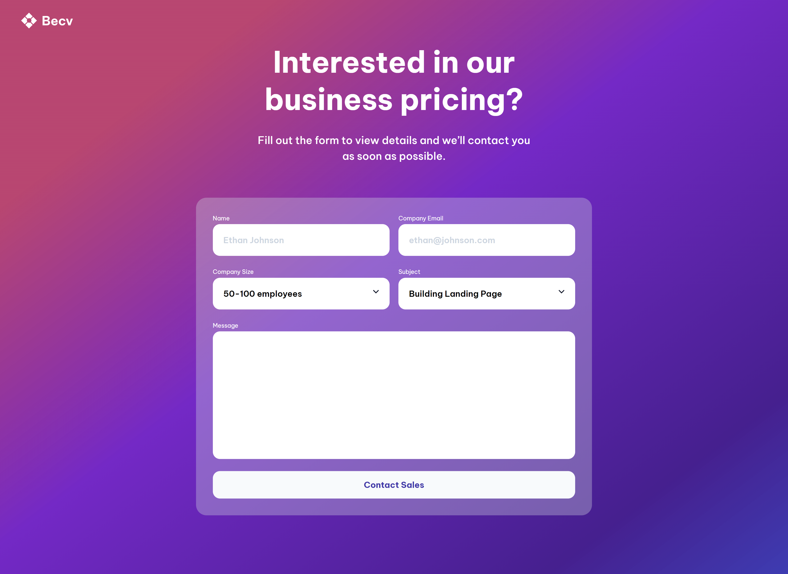

<h1 align="center">Testimonial Page using LESS Preprocessor</h1>

   Solution for a challenge from  <a href="http://devchallenges.io" target="_blank">Devchallenges.io</a>.

  <h3>
    <a href="https://contact-page-mauve.vercel.app/">
      Demo
    </a>
     | 
    <a href="https://github.com/ShrutiShinde418/DevChallenges3/tree/main/contact-page">
      Solution
    </a>
     | 
    <a href="https://devchallenges.io/challenge/31">
      Challenge
    </a>
  </h3>

<!-- TABLE OF CONTENTS -->

## Table of Contents

- [Table of Contents](#table-of-contents)
- [Overview](#overview)
  - [Built With](#built-with)
- [Features](#features)
- [Contact](#contact)

<!-- OVERVIEW -->

## Overview

### Built With

- LESS CSS
- Semantic HTML

## Features

This application/site was created as a submission to a [DevChallenges](https://devchallenges.io/challenges) challenge. The [challenge](https://devchallenges.io/challenge/31) was to build an application to complete the given user stories.

## Contact

- Portfolio Website [Portfolio](https://portfolio-devchallenges-henna.vercel.app/)
- GitHub [@ShrutiShinde418](https://github.com/ShrutiShinde418)
